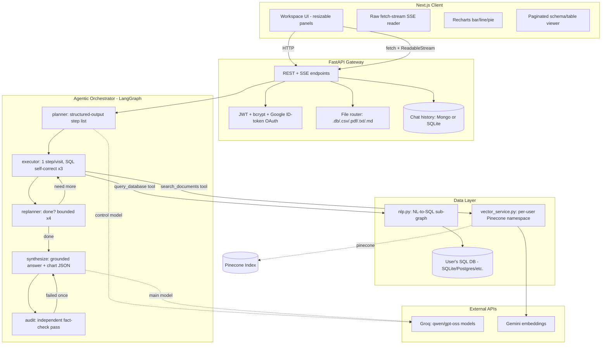

# DataTalk: Agentic Data Workspace (NL → SQL + RAG, LangGraph)

DataTalk is a full-stack AI workspace that lets you talk to your data. Connect a SQL database (or drop in a `.db`/`.csv`), upload reference documents (PDF/TXT/MD), and ask questions in plain English. A LangGraph-based agent plans, executes, and audits its own answers — deciding on its own whether a question needs a database query, a document search, both, or neither — and streams the response back with auto-rendered charts and CSV export.

**Stack:** FastAPI (Python) · Next.js/TypeScript · LangGraph · Groq (LLM inference) · Pinecone (vector store) · Gemini (embeddings) · SQLAlchemy · MongoDB Atlas (optional, SQLite fallback)

---

## 📺 Live Demo

**[Watch the demo recording](https://drive.google.com/file/d/1I6_fb0n0O_zT0Xd4IJu14eRNApqc0RD_/view?usp=drive_link)**

> ⚠️ **This demo runs in "Demo Mock Mode."** The questions asked in the recording match a fixed set of pre-scripted prompts (listed below), and the backend intercepts them to return **pre-computed answers** (with an artificial ~2s "thinking" delay) instead of live LLM calls. This is a deliberate design choice — see [Demo Mock Mode](#-demo-mock-mode) below for why — and it means the recording shows the *actual* agent output that was generated by a real run, just replayed deterministically rather than regenerated live. Running the project locally with your own Groq API key (mock mode disabled) exercises the full live agent loop described in this README.

---

## 🏗️ Architecture

The system is two services: a Next.js frontend and a FastAPI backend. The interesting part is the agent inside the backend — it's a bounded **Plan → Execute → Replan → Synthesize → Audit** loop built on LangGraph, not a single free-roaming ReAct agent.



---

## 🌟 Key Features

### 1. Bounded Plan/Execute/Replan/Synthesize/Audit Agent
Rather than one LLM call improvising tool choice, sequencing, and formatting all at once (unreliable on cheaper open-weight models), the graph splits reasoning into five narrow, single-purpose decisions:
- **Planner** — turns the question into an ordered list of `{tool, query}` steps using structured output, using recent conversation turns to resolve references like "him" or "that department."
- **Executor** — runs exactly one step per visit. SQL steps get a bounded **3-attempt self-correction loop**: if a generated query errors out, the error is fed back into the next generation attempt.
- **Replanner** — after each step, asks one narrow question ("enough info, or one more step?"), capped at 4 iterations so a model that keeps asking for "just one more step" can't loop forever.
- **Synthesize** — the only node that owns the grounding rules and the chart-output contract, since it's the only node producing user-facing text.
- **Audit** — a separate LLM pass that checks the drafted answer's specific claims (names, numbers, attributions) against the raw tool results. On failure it triggers exactly one corrected re-synthesis; if that also fails, a visible caveat is appended rather than silently shipping a flagged answer.

This design evolved from a flat ReAct loop → a fixed router (`sql | rag | hybrid | general`) → the current bounded loop, because the fixed router couldn't handle a question needing more than one lookup and had no way to loop back (see the design-rationale comments at the top of `agentic_orchestrator.py`).

### 2. Self-Healing Structured Output
Open-weight models served through Groq occasionally emit malformed tool-call JSON. `RecoverableStructuredRunnable` wraps every structured-output call with a 2-stage recovery path: (1) regex-extract and repair JSON out of the provider's `failed_generation` error payload, (2) fall back to a raw text completion with an inlined JSON schema and re-parse. This turns a class of hard 400 errors into a soft retry instead of a broken turn.

### 3. Guarded, Self-Correcting NL → SQL
- The SQL-writing sub-graph (`nlp.py`) generates a query, executes it read-only, then reports back on the result — never inventing data not present in the result set.
- **Denylist-based safety check** blocks `DROP`, `DELETE`, `TRUNCATE`, `ALTER`, `INSERT`, `UPDATE`, `CREATE`, `GRANT`, `REVOKE`, `EXEC`, `ATTACH` before execution (see [Limitations](#-known-limitations--tradeoffs) for why this isn't a complete guarantee).
- Schema introspection is **LRU-cached per database URL** so repeated turns against the same connection skip redundant reflection.

### 4. Per-User Isolated RAG
- PDF/TXT/MD uploads are chunked (1000 chars, 200 overlap) and embedded via Gemini, then upserted into a single shared Pinecone index with every vector tagged `user_id` + `filename` — retrieval is filtered per-user at query time.
- The embedding model **auto-detects the existing index's dimensionality** on startup and matches models accordingly, so the same code works against a fresh or a pre-existing index.
- Deletes (single file or full account wipe) go through the same metadata filter, with a query-then-delete-by-id fallback if a direct filtered delete isn't supported.

### 5. Flexible Data Ingestion
- Upload a `.db`/`.sqlite` file and it's instantly wired up as the active connection.
- Upload a `.csv` and it's loaded into a per-user SQLite database as a new table (`pandas.to_sql`) — joinable in the same query as any existing tables, including pre-seeded demo data.
- First real upload automatically clears the pre-seeded demo dataset so a new user doesn't accidentally query stale demo rows.

### 6. Streaming, Multi-Session Chat Workspace
- `/api/chat/stream` streams tokens over SSE, consumed on the frontend via a raw `fetch` + `ReadableStream` reader (no `EventSource`, since that can't attach an `Authorization` header).
- A **fast-path bypass** intercepts greetings/chitchat (`"hi"`, `"help"`, ≤2 words) and answers directly without ever entering the LangGraph, cutting trivial-turn latency from multi-second agent runs down to roughly the time of one LLM call.
- Multiple named chat sessions per user, each with its own history, backed by MongoDB Atlas when configured or a local SQLite file otherwise — same interface either way, so local dev needs zero external services.

### 7. Auth
- Email/password (bcrypt + JWT) and Google Sign-In (ID-token verification server-side, no client secret needed) issuing the same JWT either way.
- An explicit `ALLOW_MOCK_OAUTH` escape hatch accepts `mock_google_<email>` tokens for local/demo use without real Google credentials.

### 8. Data Visualization & Export
- The synthesizer emits a fenced ```` ```CHART ```` JSON block when a chart is appropriate; the frontend parses it into interactive Recharts bar/line/pie charts (tolerant of upper- or lower-case keys).
- Every table/chart has a one-click CSV export.
- A schema viewer reflects the live database (tables, columns, types, PK flags) with an incrementally-loaded (scroll-triggered, 50-rows-at-a-time) sample-row preview, so large tables don't get rendered in one shot.

---

## 🧠 Design Decisions & Tradeoffs

A few choices worth calling out for anyone reviewing this as an engineering sample:

| Decision | Why | Tradeoff accepted |
|---|---|---|
| Plan/Execute/Replan/Synthesize/Audit graph instead of a single ReAct agent | Open-weight models on Groq are noticeably less reliable at open-ended, multi-step tool reasoning in one pass; narrowing each node to one decision made behavior more predictable | More LLM round-trips per question → higher latency on multi-step (hybrid) queries than a single-shot agent |
| Separate, independent audit pass rather than asking the synthesizer to grade itself | A model that just generated an answer is primed to defend it; a fresh call with only the raw tool results is structurally better positioned to catch a mislabeled or invented number | Doubles the LLM calls needed for every answer that touched a tool |
| Regex/JSON-repair fallback (`RecoverableStructuredRunnable`) instead of just retrying on failure | Groq's structured-output/tool-calling path on smaller open-weight models occasionally returns malformed JSON in the *error* payload itself — regenerating from scratch wastes a good answer that already exists in the exception | Adds real parsing complexity and multiple fallback branches to maintain |
| Keyword-denylist SQL guard instead of an allowlist or a read-only DB role | Fast to implement and enough to stop the common cases (`DROP`, `DELETE`, etc.) without a bigger sandboxing project | **Not a real security boundary** — see [Limitations](#-known-limitations--tradeoffs) |
| MongoDB Atlas with automatic SQLite fallback for chat history/users | Lets the whole app run fully offline/locally with zero external accounts, while still being production-ready with a real database | Two storage code paths to maintain and keep behaviorally identical (same tests run against both) |
| Fast-path greeting bypass before entering LangGraph | Trivial turns ("hi", "help") don't need a 5-node graph; skipping it directly saves several LLM calls and multiple seconds of latency for the most common conversation opener | A second, informal classifier (keyword/length heuristic) living outside the graph, rather than one unified routing decision |
| Demo Mock Mode intercepting `/api/chat/stream` for a fixed prompt set | Live demos over Groq's free tier can hit token-per-minute limits or occasional multi-step latency mid-presentation; a scripted, deterministic fallback keeps demos reliable | The showcased answers are replayed rather than generated live — clearly labeled as such (see below) |

---

## ⚠️ Known Limitations & Tradeoffs

- **The SQL guard is a keyword denylist, not a sandbox.** `validate_sql_safety()` regex-matches for dangerous keywords before execution. It stops naive destructive queries but is not hardened against obfuscation (e.g. comments, alternate casing tricks, or dialect-specific statement forms) and does not run queries under a restricted DB role. For a production deployment, a read-only database user/connection plus statement-level sandboxing would be the correct additional layer.
- **Pinecone document listing is best-effort.** `list_user_documents()` samples up to 1000 vectors via a dummy-vector query since Pinecone has no native "list distinct metadata values" operation — on a very large per-user corpus this could miss some filenames.
- **Single shared Pinecone index for all users.** Isolation is enforced entirely at the metadata-filter level (`user_id`), not via separate indexes/namespaces — correct but means a bug in the filter logic would be a cross-tenant data leak, so that path is worth extra scrutiny in code review.
- **Local SQLite databases are single-file and not concurrency-safe under heavy write load.** Fine for a demo/portfolio deployment or light usage; a real multi-tenant deployment would want Postgres per user or a managed SQL layer.
- **`docker-compose.yml`'s `JWT_SECRET` env var name doesn't match what `auth_controller.py` reads (`JWT_SECRET_KEY`).** Running via Docker Compose as-is means the backend falls back to a `None` JWT secret unless this is fixed — a good example of the kind of drift that creeps in between infra config and application code; flagged here rather than silently patched.
- **Structured-output recovery adds latency on the unhappy path.** When a model's native tool-call fails, the fallback (raw completion + regex JSON extraction) costs an extra full LLM round trip before the graph can proceed.
- **No user-facing rate limiting or per-user quota enforcement** on LLM calls, uploads, or vector storage — fine for a resume project, a gap for multi-tenant production use.
- **Chart generation is prompt-contract based, not schema-validated.** The synthesizer is instructed to emit a specific ```` ```CHART ```` JSON shape; the frontend parses it defensively but a sufficiently malformed block will simply fail to render rather than being caught earlier in the pipeline.

---

## 🔭 Future Scope

- Swap the SQL keyword denylist for a real read-only database role/connection plus a query-plan-level check.
- Add per-user rate limiting / quota tracking on LLM and embedding calls.
- Move Pinecone from single-index-with-metadata-filter to per-user namespaces as usage scales, to reduce cross-tenant blast radius and improve listing performance.
- Add streaming for the RAG/hybrid synthesis path as thoroughly as the general fast-path already streams (today the SSE path streams synthesis output, but the plan/execute/replan phases before it are not visible token-by-token to the user).
- Support additional SQL dialects/warehouses beyond SQLite/whatever SQLAlchemy URL is supplied (e.g. first-class Postgres/BigQuery/Snowflake connectors with dialect-specific prompting).
- Add automated eval harness for agent answer quality (grounding/accuracy regression tests) rather than relying on manual benchmark runs.

---

## ⚙️ Environment Variables

Configure `backend/.env` (see `backend/.env` for the working local template) and `frontend/.env.local`.

### Backend (`backend/.env`)
```ini
# Server
PORT=8000
HOST=0.0.0.0

# JWT auth — note the variable name is JWT_SECRET_KEY, not JWT_SECRET
JWT_SECRET_KEY=your-secure-jwt-secret
JWT_ALGORITHM=HS256
JWT_EXPIRATION_HOURS=24

# Chat history / users — optional; falls back to local SQLite (backend/context/*.db) if unset
MONGODB_URI=
DATABASE_NAME=datatalk

# RAG — optional; document search is disabled (with a clear error message) if unset
PINECONE_API_KEY=your-pinecone-api-key
GOOGLE_API_KEY=your-google-generative-ai-key   # used by the Gemini embeddings client

# LLM — required for live (non-demo-mock) responses; get a key at console.groq.com
GROQ_API_KEY=your-groq-api-key
LLM_MODEL=openai/gpt-oss-20b        # main synthesis/reasoning model
LLM_CONTROL_MODEL=openai/gpt-oss-20b # planner/replanner/audit structured-output model

# Demo behavior — see "Demo Mock Mode" below
DEMO_MOCK_MODE=false      # true intercepts /api/chat/stream with scripted responses
ALLOW_MOCK_OAUTH=false    # true accepts mock_google_<email> tokens without real Google verification

# Google OAuth (ID-token verification only — no client secret needed server-side)
GOOGLE_CLIENT_ID=your-google-oauth-client-id

CORS_ORIGINS=http://localhost:3000,http://127.0.0.1:3000
```
If `GROQ_API_KEY` is unset entirely, the backend runs in a hard "no LLM" demo mode and returns a fixed message explaining that the key needs to be configured — distinct from `DEMO_MOCK_MODE`, which intercepts specific pre-scripted questions while still using a real key for anything else.

### Frontend (`frontend/.env.local`)
```ini
NEXT_PUBLIC_API_URL=http://localhost:8000
NEXT_PUBLIC_GOOGLE_CLIENT_ID=your-google-oauth-client-id
```

---

## 🚀 Running Locally

### Option 1: Docker Compose
```bash
docker-compose up --build
```
Backend on `http://localhost:8000`, frontend on `http://localhost:3000`.

> **Note:** `docker-compose.yml` currently passes `JWT_SECRET` as the container env var, but the backend reads `JWT_SECRET_KEY`. Until that's aligned, either edit `docker-compose.yml` to use `JWT_SECRET_KEY`, or pass a `backend/.env` file into the container instead of relying on the compose `environment:` block.

### Option 2: Manual Setup

**Backend:**
```bash
cd backend
python -m venv .venv
source .venv/bin/activate        # .venv\Scripts\activate on Windows
pip install -r requirements.txt
# create backend/.env with the variables listed under "Environment Variables" above
uvicorn main:app --reload --port 8000
```
The demo SQLite database (`departments`/`employees`/`projects`/`employee_project`) auto-seeds on first use — no manual DB setup required to start exploring.

**Frontend:**
```bash
cd frontend
npm install
npm run dev
```
Then open `http://localhost:3000`, sign up (or use Google Sign-In / `ALLOW_MOCK_OAUTH`), and go to `/playground`.

### Minimal path to a live (non-demo-mock) agent run
1. Get a free API key from [console.groq.com](https://console.groq.com).
2. Set `GROQ_API_KEY` and `DEMO_MOCK_MODE=false` in `backend/.env`.
3. (Optional, for document RAG) Set `PINECONE_API_KEY` and `GOOGLE_API_KEY`.
4. Restart the backend and ask a question in the playground — you'll see the full plan/execute/replan/synthesize/audit loop run against a live model.

---

## 🎬 Demo Mock Mode

`DEMO_MOCK_MODE` (default: `true` in the shipped `.env`) exists to keep live demos and code-review walkthroughs reliable: Groq's free/shared-tier endpoints can hit token-per-minute limits or have a slow multi-step hybrid query mid-presentation, and a scripted deterministic path avoids both.

When enabled, `/api/chat/stream` recognizes a **fixed sequence** of demo questions per session (matched by turn index, not by re-reading the question text) and streams back **pre-computed answers** — with a ~2 second artificial delay to preserve the feel of an agent actually working — instead of calling the LLM. Answers were originally generated for real by the live agent, then hard-coded so demos don't depend on live model availability. Any question outside the scripted sequence returns a message pointing back to the scripted prompts.

### Supported demo questions (in order)
1. *"List all departments and their budgets"* → SQL query simulation
2. *"Show employee salaries and their departments"* → SQL query simulation
3. *"Plot department salaries compared to their budgets"* → SQL query + chart rendering simulation
4. *"What are the company target budgets for next year?"* → document RAG search simulation against `demo_target_budgets.txt`
5. *"Are there any extra benefits listed in the CSV?"* → CSV analysis simulation against `demo_extra_benefits.csv`

Clear the active chat session to restart the sequence, or set `DEMO_MOCK_MODE=false` to disable it entirely and hit the live agent with any question.

---

## 🧪 Testing & CI/CD

```bash
cd backend
pytest
```
Backend tests (`backend/tests/`) cover auth (signup/login/Google OAuth/token verification), the chat controller, the user and chat-history models across both the MongoDB and SQLite code paths, the document retriever helpers, and core FastAPI route wiring — roughly 1,000 lines of test code across 8 test modules.

GitHub Actions (`.github/workflows/ci.yml`) runs on every push/PR to `main`/`master`:
- **Backend job**: installs `requirements.txt` and runs the full `pytest` suite against mock credentials.
- **Frontend job**: installs npm dependencies and runs `npm run build` to catch TypeScript/build errors.

---

## 📁 Repository Structure

```
backend/
  main.py                    # FastAPI app, CORS, /health and /api/status
  agentic_orchestrator.py    # LangGraph agent: planner/executor/replanner/synthesize/audit
  nlp.py                     # NL-to-SQL sub-graph, SQL safety checks, demo DB auto-seed
  services/vector_service.py # Per-user Pinecone document vectorization & retrieval
  utils/llm_client.py        # Cached Groq client factory (returns None → demo mode if unset)
  utils/retriever_helper.py  # User-scoped retriever + document-existence checks
  controllers/               # Auth & chat business logic
  routes/                    # FastAPI route definitions (auth, chat, uploads, schema, etc.)
  models/                    # User & chat-history persistence (Mongo w/ SQLite fallback)
  schemas/                   # Pydantic request/response models
  tests/                     # Pytest suite (~1,000 lines across 8 modules)
frontend/
  src/app/playground/        # Main authenticated workspace (resizable chat + sources panel)
  src/app/components/        # Inference/chat renderer, file upload, schema viewer, etc.
  src/app/login, signup/     # Auth pages
docker-compose.yml           # Two-service local orchestration
.github/workflows/ci.yml     # CI: backend pytest + frontend build
```