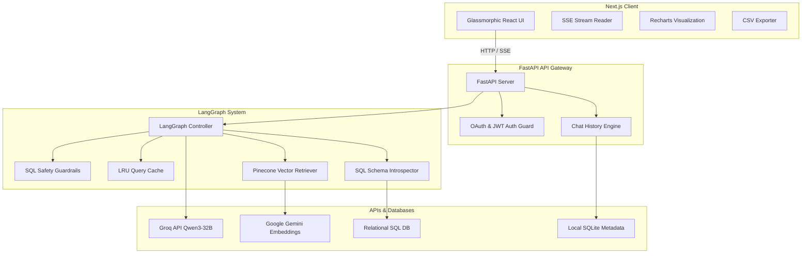

# DataTalk: High-Performance AI Collaborative Data Agent Workspace

DataTalk is a state-of-the-art, resume-worthy platform that bridges natural language and structured/unstructured databases. Powered by a collaborative LangGraph orchestrator, it allows users to upload documents (PDFs, text) for real-time vector search (RAG) and connect relational databases to execute safe SQL queries dynamically, complete with interactive Recharts visualizations and CSV exports.

---

## 🏗️ Architecture



---

## 🌟 Key Features

### 1. Collaborative Multi-Agent Orchestrator
- **State-of-the-Art Routing**: Automates decision-making to direct questions to SQL introspection, vector stores (RAG), or generic LLM context using LangGraph.
- **LRU Introspection Cache**: Caches SQL schema lookups to eliminate introspective query overhead.
- **Thread-Safe Debug Logger**: Uses ContextVar-based logging to capture telemetry without cross-request corruption.

### 2. Guarded SQL Synthesis
- **Safe SQL Synthesis**: Automatically checks and rejects destructive keywords (`DROP`, `DELETE`, `TRUNCATE`, `ALTER`, etc.) before execution.
- **Zero-Dependency Markdown & Interactive Tables**: Outputs results dynamically in beautifully styled React tables.

### 3. Full-Spectrum Data Visualization
- **Recharts Integration**: Automatically parses charts generated by the assistant into interactive Bar, Line, or Pie charts.
- **CSV Data Exporter**: Instant browser downloads for synthesized tables and chart data matrices.

### 4. Interactive Workspace Experience
- **Real-Time Token Streaming**: Server-Sent Events (SSE) stream text tokens to the user interface dynamically.
- **Multi-Thread Chat Sessions**: Sidebar-navigated workspace history allowing multiple concurrent sessions with automated title generation from the first query.
- **Google OAuth & Secure Signup**: Combined session/local storage-guarded authentication pipeline.

---

## ⚙️ Development Environment Variables

Configure these in `backend/.env` and `frontend/.env.local`:

### Backend Environment Variables
```ini
PORT=8000
JWT_SECRET=your-secure-jwt-secret
GROQ_API_KEY=your-groq-api-key
PINECONE_API_KEY=your-pinecone-api-key
GOOGLE_CLIENT_ID=your-google-oauth-client-id
GOOGLE_CLIENT_SECRET=your-google-oauth-client-secret
CORS_ORIGINS=http://localhost:3000
MONGODB_URI=your-mongodb-atlas-uri # Optional, falls back to SQLite
DATABASE_NAME=datatalk
DEBUG_MODE=false
```

### Frontend Environment Variables
```ini
NEXT_PUBLIC_API_URL=http://localhost:8000
```

---

## 🚀 Running DataTalk

### Method 1: Single-Command Docker Compose (Recommended)
Launch the entire system locally with a single command:
```bash
docker-compose up --build
```
This spins up the FastAPI backend on `http://localhost:8000` and the Next.js frontend on `http://localhost:3000`.

### Method 2: Manual Local Setup

#### Backend Setup
1. Enter the backend directory and set up a virtual environment:
   ```bash
   cd backend
   python -m venv .venv
   source .venv/bin/activate
   pip install -r requirements.txt
   ```
2. Launch the API server:
   ```bash
   uvicorn main:app --reload --port 8000
   ```

#### Frontend Setup
1. Enter the frontend directory:
   ```bash
   cd frontend
   npm install
   ```
2. Launch the Next.js development server:
   ```bash
   npm run dev
   ```

---

## 🧪 Testing & CI/CD
Run the backend test suite:
```bash
cd backend
./.venv/bin/pytest
```
DataTalk uses a **GitHub Actions CI Pipeline** (`.github/workflows/ci.yml`) to automatically validate type checks, lint checks, and unit tests on every pull request and push to the main branch.
